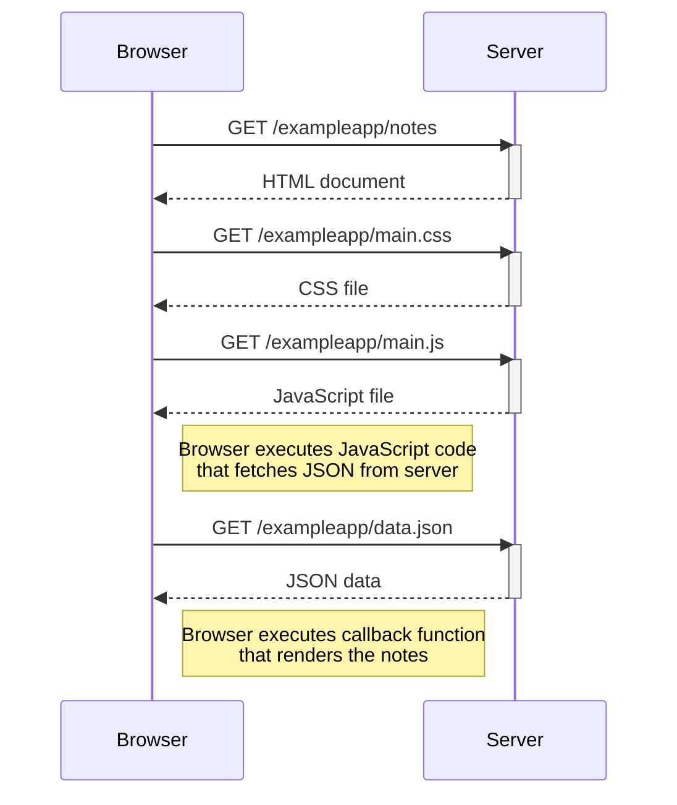

```mermaid
sequenceDiagram
    participant Browser
    participant Server

    Browser->>Server: GET /exampleapp/notes
    activate Server
    Server-->>Browser: HTML document
    deactivate Server

    Browser->>Server: GET /exampleapp/main.css
    activate Server
    Server-->>Browser: CSS file
    deactivate Server

    Browser->>Server: GET /exampleapp/main.js
    activate Server
    Server-->>Browser: JavaScript file
    deactivate Server

    Note right of Browser: Browser executes JavaScript code<br/>that fetches JSON from server

    Browser->>Server: GET /exampleapp/data.json
    activate Server
    Server-->>Browser: JSON data
    deactivate Server

    Note right of Browser: Browser executes callback function<br/>that renders the notes
```
